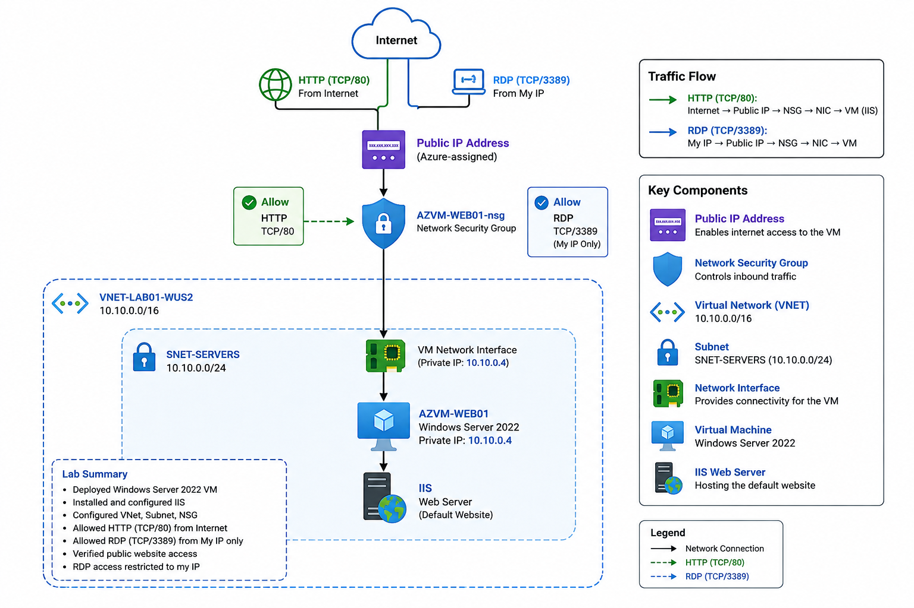
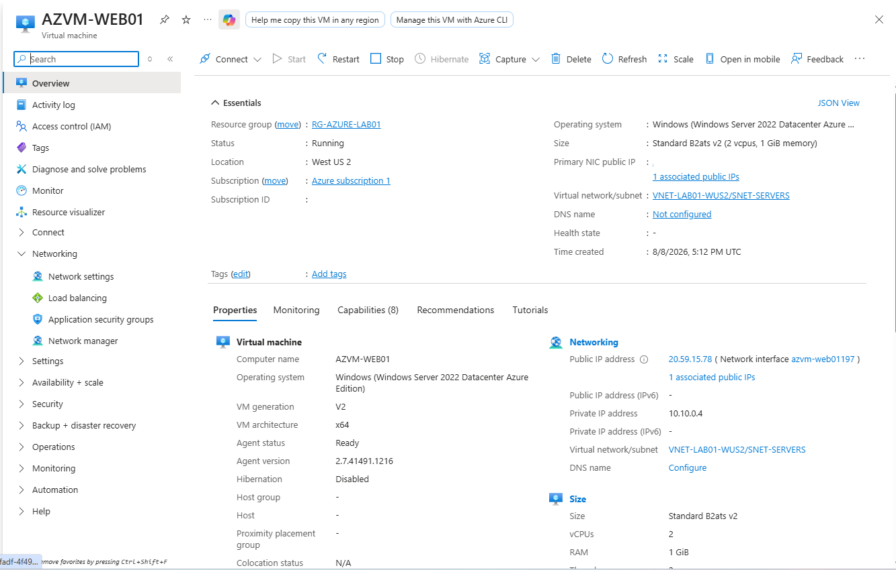
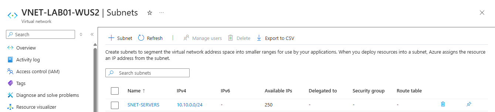
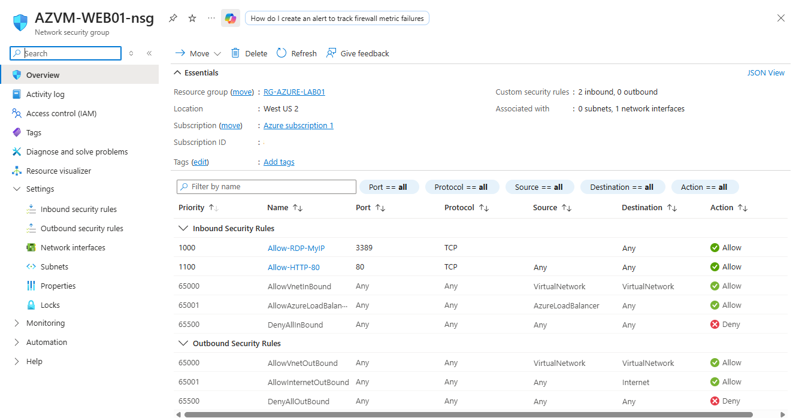
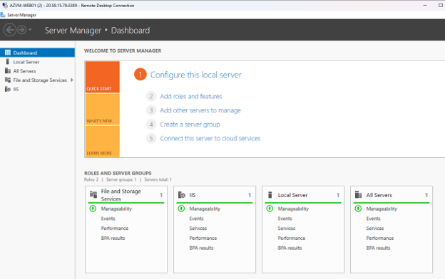
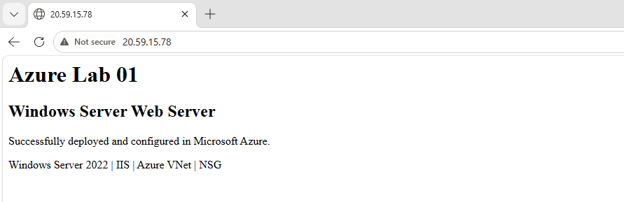

# azure-windows-web-server-lab
# Azure Windows Server Web Server Lab

## Project Overview

This hands-on Azure lab demonstrates the deployment and configuration of a Windows Server 2022 virtual machine running Internet Information Services (IIS).

The objective was to practice core Microsoft Azure administration tasks, including virtual networking, subnetting, Network Security Groups (NSGs), virtual machine deployment, secure RDP access, IIS configuration, and public web connectivity.

This project was completed as part of my hands-on practice following achievement of the Microsoft Certified: Azure Administrator Associate (AZ-104) certification.

---

## Architecture

### Network Design

- **Region:** West US 2
- **Virtual Network:** `VNET-LAB01-WUS2`
- **VNet Address Space:** `10.10.0.0/16`
- **Subnet:** `SNET-SERVERS`
- **Subnet Address Range:** `10.10.0.0/24`
- **Virtual Machine:** `AZVM-WEB01`
- **Operating System:** Windows Server 2022 Datacenter: Azure Edition
- **Private IP:** `10.10.0.4`
- **Web Server:** Microsoft IIS

---

## Azure Resources

The lab included the following Azure resources:

| Resource | Purpose |
|---|---|
| Resource Group | Logical container for the lab resources |
| Virtual Network | Provides private Azure network connectivity |
| Subnet | Dedicated subnet for server resources |
| Virtual Machine | Hosts Windows Server 2022 and IIS |
| Network Interface | Connects the VM to the Azure VNet |
| Public IP | Provides external connectivity to the VM |
| Network Security Group | Controls inbound network traffic |

---

## Security Configuration

A Network Security Group was associated with the virtual machine network interface.

Two custom inbound rules were configured:

| Priority | Rule | Port | Protocol | Source | Action |
|---|---|---:|---|---|---|
| 1000 | Allow-RDP-MyIP | 3389 | TCP | Administrator public IP only | Allow |
| 1100 | Allow-HTTP-80 | 80 | TCP | Internet | Allow |

RDP access was restricted to the administrator's public IP instead of allowing TCP/3389 from the entire Internet.

The default NSG deny rule blocks other inbound connections that are not explicitly permitted by a higher-priority rule.

---

## Implementation

### 1. Virtual Network

Created the Azure virtual network:

`VNET-LAB01-WUS2`

with address space:

`10.10.0.0/16`

A server subnet was created:

`SNET-SERVERS`

with address range:

`10.10.0.0/24`

### 2. Windows Server Virtual Machine

Deployed:

`AZVM-WEB01`

using Windows Server 2022 Datacenter: Azure Edition.

The VM was connected to `SNET-SERVERS` and assigned a private IP address from the subnet.

### 3. Secure Remote Administration

Remote Desktop access was configured using TCP port 3389.

The NSG source was restricted to the administrator's public IP address rather than allowing RDP access from any Internet address.

### 4. IIS Web Server

The Web Server (IIS) role was installed on Windows Server 2022.

IIS availability was first verified locally from the server.

A custom HTML page was then deployed to the IIS web root.

### 5. Public Web Access

TCP port 80 was allowed through the NSG.

The website was successfully accessed externally using the VM's public IP address.

---

## Testing and Validation

Connectivity and service availability were tested from both the Azure VM and an external workstation.

PowerShell was used to verify that IIS was listening on TCP port 80:

    Get-NetTCPConnection -LocalPort 80 -State Listen

Local IIS connectivity was tested using:

    Test-NetConnection -ComputerName localhost -Port 80

External TCP connectivity was also tested against the VM's public endpoint on port 80.

The final custom IIS webpage was successfully accessed from an external web browser.

---

## Troubleshooting

Several issues were encountered and resolved during the lab.

### VNet and Subnet Configuration

An initial subnet configuration was outside the selected VNet address space.

The VNet and subnet addressing were corrected to:

- VNet: `10.10.0.0/16`
- Subnet: `10.10.0.0/24`

### VM Size Availability

The initially selected VM size was unavailable for the subscription/region combination.

An available VM size was selected to continue the deployment.

### RDP Connectivity

The VM initially did not have the required public connectivity for direct RDP access.

A public IP address was associated with the VM's network interface, and TCP/3389 connectivity was validated.

For improved security, the RDP NSG rule was restricted to the administrator's public IP.

### HTTP Connectivity

IIS worked successfully through `localhost`, but the website initially could not be reached externally.

Troubleshooting included:

- Confirming IIS was listening on TCP/80
- Confirming the NSG allowed TCP/80
- Testing TCP connectivity from an external workstation
- Verifying the VM public IP configuration
- Testing the website from another browser

External TCP testing succeeded, and the custom IIS website was successfully accessed.

---

## Screenshots

### Azure VM Overview

### Virtual Network and Subnet

### Network Security Group Rules

### IIS Installed on Windows Server 2022

### Public Website

---

## Cost Management and Cleanup

After completing the deployment, connectivity testing, validation, and documentation, the lab resource group was deleted to prevent unnecessary Azure resource charges.

This cleanup removed the temporary resources created specifically for the lab.

---

## Skills Demonstrated

This lab provided hands-on practice with:

- Microsoft Azure Virtual Machines
- Azure Virtual Networks
- IPv4 subnetting
- Network Security Groups
- Azure public and private IP addressing
- Windows Server 2022 administration
- Remote Desktop administration
- Internet Information Services (IIS)
- PowerShell network troubleshooting
- TCP/IP connectivity testing
- Azure resource cleanup and cost awareness

---

## Certification

**Microsoft Certified: Azure Administrator Associate (AZ-104)**

This repository documents hands-on Azure practice performed to reinforce Azure administration skills and concepts.
